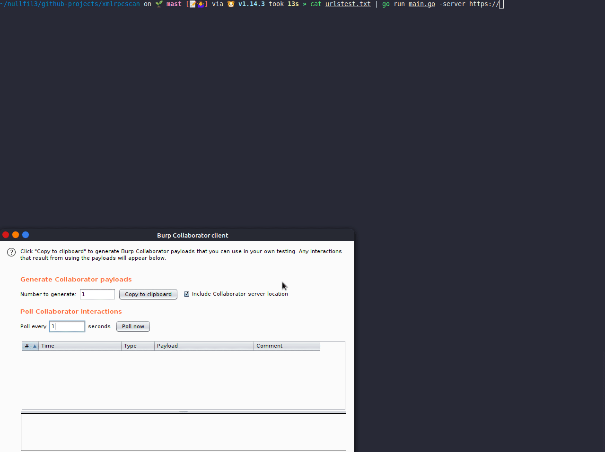

# xmlrpc-scan

Scan urls or a single URL against XMLRPC wordpress issues.

usage:

##### Install

- Download from releases: https://github.com/nullfd/xmlrpc-scan/releases
- Or Compiling by yourself


##### Features

- Verify if XMLRPC interface from Wordpress is open;
- Testing all possible SSRF methods against xmlrpc wordpress;
- Testing the SSRF oem proxy [https://book.hacktricks.xyz/network-services-pentesting/pentesting-web/wordpress](https://book.hacktricks.xyz/network-services-pentesting/pentesting-web/wordpress)
- Generate unique url from each ssrf attempt;


##### Usage

* List of wordpress urls 
```bash
cat urls.txt | xmlrpcscan -server http://burpcollaborator.net
```

* Single URL
```bash
xmlrpcscan -target https://target.com -server http://burpcollaborator.net
```



